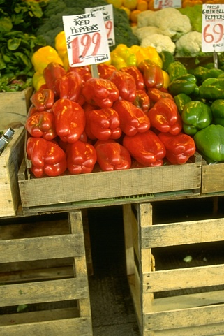
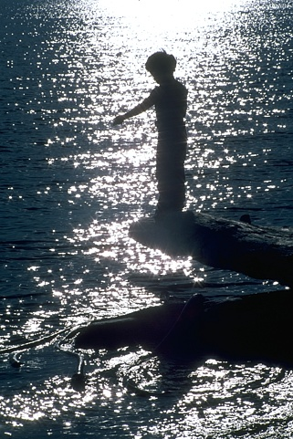
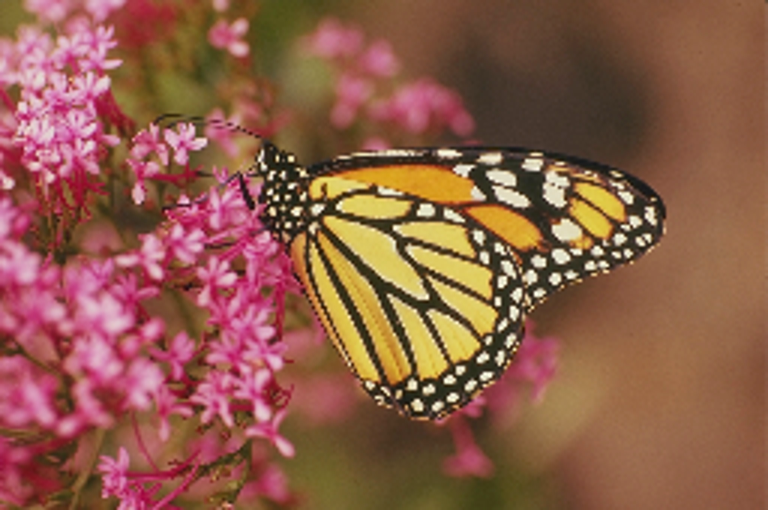
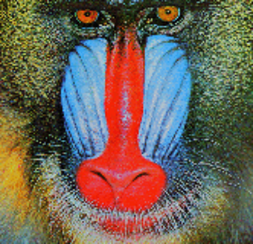

# Image-super-resolution

The purpose of this project is to do image super resolution on low resolution pictures and to get high resolution one, we mainly use VDSR as our model architecture.
## Environment

 ```
!pip install -U torch==1.5 torchvision==0.6 -f https://download.pytorch.org/whl/cu101/torch_stable.html
  ```
  
## Dataset
The dataset includes 291 training images and 14 test images.

------------------
  
  
-------------------


## Train

Using the following commands to start the training process. To see more detailed steps, refer to  ```main.py ``` .
```
python main.py
```

## Results
------------------
image before upscaling


image after upscaling



image before upscaling


image after upscaling




-------------------

## Credits
1) https://github.com/2KangHo/vdsr_pytorch
2) https://github.com/twtygqyy/pytorch-vdsr
